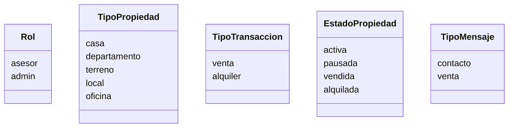
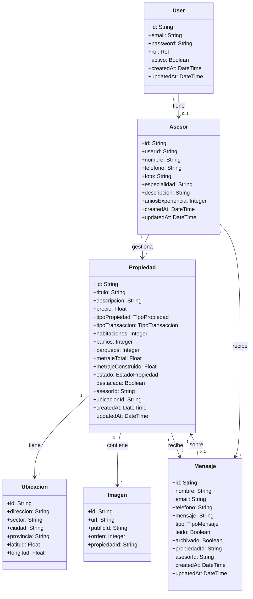
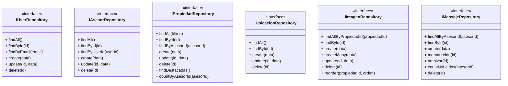
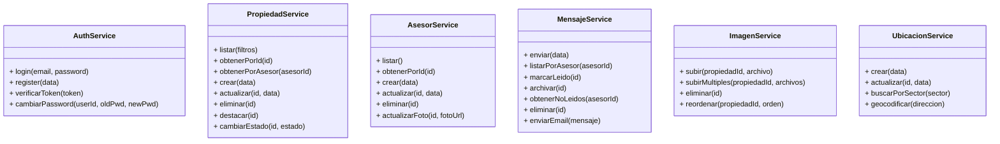
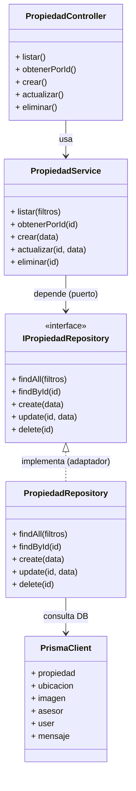

# Diagrama de Clases — Alpha Inmobiliaria

**Proyecto:** Alpha Inmobiliaria
**Arquitectura:** Hexagonal (Puertos y Adaptadores)
**ORM:** Prisma 7 + PostgreSQL

---

## Enums

---

## Entidades del Dominio

---

## Repositorios (Puertos)

---

## Servicios (Casos de Uso)

---

## DTOs (Data Transfer Objects)

```mermaid
classDiagram
    class CreatePropiedadRequest {
        +titulo: String
        +descripcion: String
        +precio: Number
        +tipoPropiedad: TipoPropiedad
        +tipoTransaccion: TipoTransaccion
        +habitaciones: Number
        +banios: Number
        +parqueos: Number
        +metrajeTotal: Number
        +metrajeConstruido: Number
        +ubicacion: CreateUbicacionDTO
    }

    class UpdatePropiedadRequest {
        +titulo: String
        +descripcion: String
        +precio: Number
        +tipoPropiedad: TipoPropiedad
        +tipoTransaccion: TipoTransaccion
        +habitaciones: Number
        +banios: Number
        +parqueos: Number
        +estado: EstadoPropiedad
        +destacada: Boolean
        +ubicacion: UpdateUbicacionDTO
    }

    class PropiedadResponse {
        +id: String
        +titulo: String
        +descripcion: String
        +precio: Number
        +tipoPropiedad: String
        +tipoTransaccion: String
        +habitaciones: Number
        +banios: Number
        +parqueos: Number
        +estado: String
        +destacada: Boolean
        +asesor: AsesorResumenDTO
        +ubicacion: UbicacionResponse
        +imagenes: ImagenResponse[]
        +createdAt: String
    }

    class CreateAsesorRequest {
        +nombre: String
        +email: String
        +password: String
        +telefono: String
        +foto: String
        +especialidad: String
        +descripcion: String
        +aniosExperiencia: Number
        +rol: Rol
    }

    class AsesorResponse {
        +id: String
        +nombre: String
        +email: String
        +telefono: String
        +foto: String
        +especialidad: String
        +descripcion: String
        +aniosExperiencia: Number
        +rol: String
        +propiedadesCount: Number
        +mensajesNoLeidos: Number
    }

    class LoginRequest {
        +email: String
        +password: String
    }

    class AuthResponse {
        +token: String
        +usuario: AsesorResponse
    }

    class CreateMensajeRequest {
        +nombre: String
        +email: String
        +telefono: String
        +mensaje: String
        +tipo: TipoMensaje
        +propiedadId: String
        +asesorId: String
    }

    class CreateUbicacionDTO {
        +direccion: String
        +sector: String
        +ciudad: String
        +provincia: String
        +latitud: Number
        +longitud: Number
    }
```

---

## Arquitectura Hexagonal (Flujo por Capas)

---

## Tabla de Relaciones

| Entidad A | Cardinalidad | Entidad B | Descripcion |
|---|---|---|---|
| User | 1 -- 0..1 | Asesor | Un usuario puede tener perfil de asesor o no |
| Asesor | 1 -- N | Propiedad | Un asesor gestiona muchas propiedades |
| Asesor | 1 -- N | Mensaje | Un asesor recibe muchos mensajes |
| Propiedad | 1 -- 1 | Ubicacion | Cada propiedad tiene una ubicacion unica |
| Propiedad | 1 -- N | Imagen | Una propiedad tiene muchas imagenes |
| Propiedad | 1 -- N | Mensaje | Una propiedad recibe muchos mensajes |
| Mensaje | N -- 1 | Asesor | Muchos mensajes pertenecen a un asesor |
| Mensaje | N -- 0..1 | Propiedad | Muchos mensajes pueden referir a una propiedad |

---

## Validaciones por Entidad

| Entidad | Campo | Validacion |
|---|---|---|
| User | email | Formato email valido, unico en DB |
| User | password | Min 8 caracteres, hash bcrypt |
| Asesor | nombre | No vacio, max 100 caracteres |
| Asesor | telefono | Formato valido (+593, 09...) |
| Propiedad | precio | Numero positivo, mayor a 0 |
| Propiedad | titulo | No vacio, max 200 caracteres |
| Propiedad | habitaciones | Entero no negativo |
| Mensaje | nombre | No vacio |
| Mensaje | email | Formato email valido |
| Mensaje | mensaje | Min 10 caracteres |
| Ubicacion | latitud | Rango -90 a 90 |
| Ubicacion | longitud | Rango -180 a 180 |
| Imagen | url | URL valida de Cloudinary |
